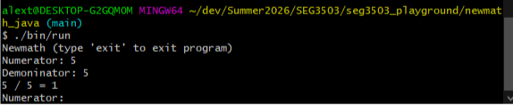
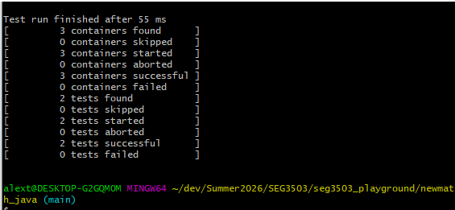
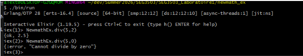
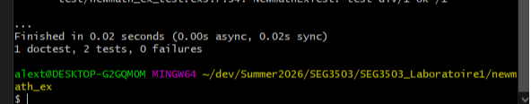

# seg3503_playground

| Outline   | Value                    |
| --------- | ------------------------ |
| Course    | SEG 3503                 |
| Date      | Summer 2026              |
| Student   | Alexandre Turgeon        |
| Email     | aturg052@uottawa.ca      |
| Professor | Mouhcine Guennoun        |
| TA        | Mohamed Nefsi            |

Bac à sable pour les laboratoires du cours SEG3503. Chaque laboratoire est dans son
propre répertoire :

- [`lab01/`](./lab01) — Lab 1 : implémentations d'une division entière en
  [`newmath_java/`](./lab01/newmath_java) (Java + JUnit 5) et
  [`newmath_ex/`](./lab01/newmath_ex) (Elixir + ExUnit).
- [`lab02/`](./lab02) — Lab 2 : classes d'équivalence — voir
  [`lab02/README.md`](./lab02/README.md) (exercice 1 : test manuel de
  `user-registration-app` ; exercice 2 : tests JUnit de `Date.nextDate`).
- [`lab03/`](./lab03) — Lab 3 : mesures de couverture avec JaCoCo — voir
  [`lab03/README.md`](./lab03/README.md) (projets `date` et `computation`).

Les scripts `bin/run`, `bin/test`, `bin/compile` sont des scripts **bash**. Sous
Windows, exécutez-les depuis **Git Bash** (et non PowerShell), car ils utilisent
des séparateurs de chemin Unix.

---

## Lab 1 — newmath_java (Java + JUnit)

### Prérequis
- JDK 11+ (testé avec OpenJDK 23)
- Git Bash sous Windows (ou un shell bash sous macOS/Linux)

### Exécuter le programme interactif

```bash
cd lab01/newmath_java
./bin/run
```

Le programme demande un numérateur et un dénominateur, affiche le résultat de
la division entière, et recommence jusqu'à ce que l'on tape `exit`.

### Exécuter les tests JUnit

```bash
cd lab01/newmath_java
./bin/test
```

Deux tests sont attendus : `div_ok()` et `div_by_zero()`.

### Capture d'écran — Java run



### Capture d'écran — Java test (JUnit)



---

## Lab 1 — newmath_ex (Elixir + ExUnit)

### Prérequis
- Elixir 1.14+ (installe automatiquement Erlang/OTP comme dépendance)

### Exécuter le programme interactif (IEx)

```bash
cd lab01/newmath_ex
./bin/run
```

Puis, dans la session IEx :

```elixir
iex> NewmathEx.div(5, 2)
{:ok, 2.5}
iex> NewmathEx.div(5, 0)
{:error, "Cannot divide by zero"}
```

### Exécuter les tests ExUnit

```bash
cd lab01/newmath_ex
./bin/test
```

Trois assertions sont attendues : 1 doctest + 2 tests.

### Capture d'écran — Elixir run



### Capture d'écran — Elixir test (ExUnit)


